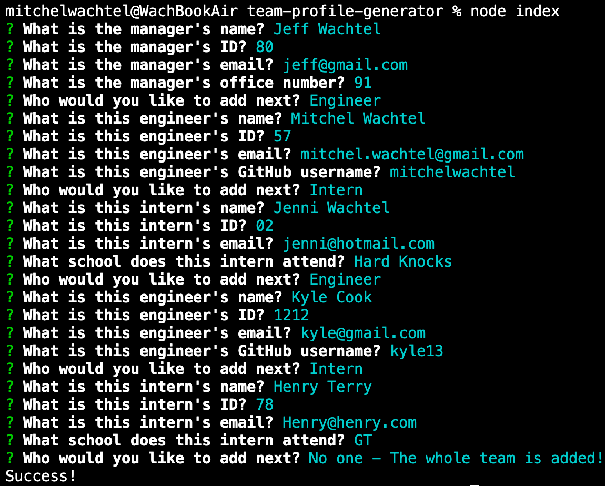

# team-profile-generator
## Mitchel Wachtel - mitchel.wachtel@gmail.com

---
### Description
This app is to be used to collect information about a developer team and generate an HTML file. The user does not have to think about HTML or CSS formatting or what information to display, they simply answer the provided questions and this app does the hard work of creating the file.

---
### Table of contents
* [Installation](#installation)
* [Technology](#technology)
* [Usage](#usage)
* [License](#license)
* [Contributing](#contributing)
* [Tests](#tests)
* [Questions](#questions)
---

### Installation
To install the dependencies necessary to run use the application, the user should run the following command first:

`npm i`

---

### Technology

Technologies used: node.js, npm, dependencies: 'inquirer' and 'jest' and 'fs', VS Code.

---
### Usage
The application will run through a series of questions in your terminal. Answer them thoroughly in order for the team-profile.html file to be completed fully. The team-profile.html file will be created in the folder "dist" and will be set up to link to a style.css file also in the dist directory. You can rename this html file when moved to your repository, but don't forget to move the style.css file as well.

Watch *[this video](https://youtu.be/azwPOmFgYhM)* to see the how using this app works.

---
---
---
### License

Read more about the MIT License *[here](https://opensource.org/licenses/MIT)*.

---
### Contributing
Please contact mitchel.wachtel@gmail.com if you have any desire to contribute to this project.

---
### Tests
To run tests on the application, the user should run the following command:

`npm test`

---
### Questions
If you have any questions, please send me an email at mitchel.wachtel@gmail.com and I'll be quick to get back to you! You can also open an issue on GitHub. Find me on GitHub at https://github.com/mitchelwachtel if you are interested in any of my other work.

